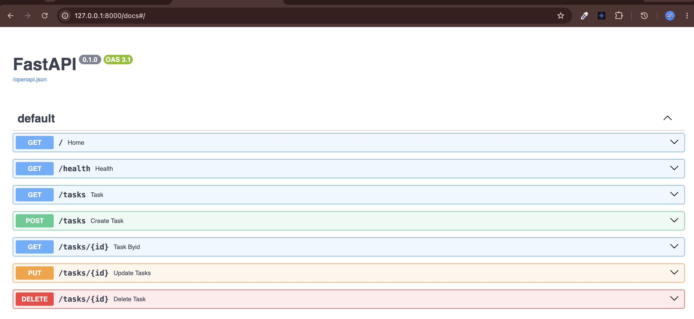
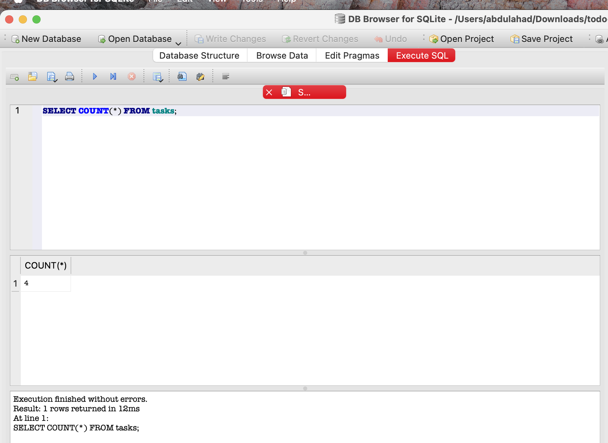
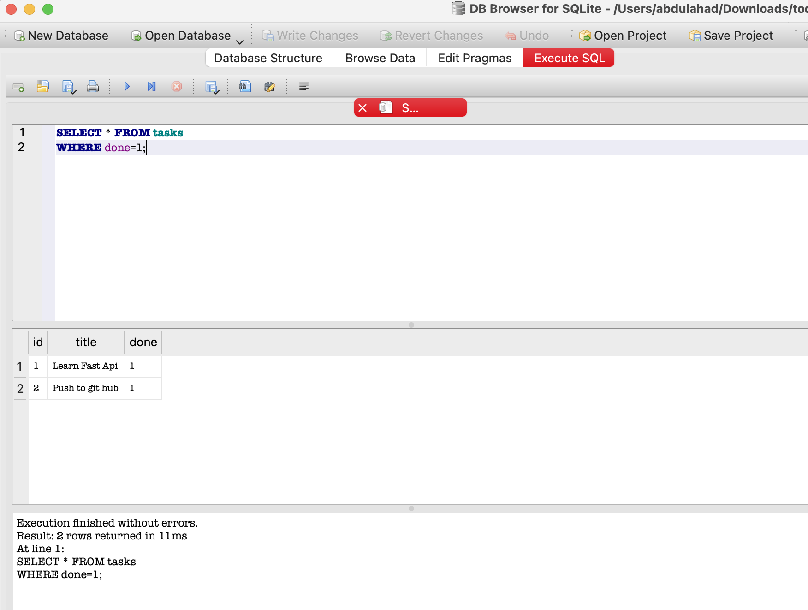

# 🚀 Todo API — FastAPI CRUD with SQLite Persistence

A RESTful Todo API built with **FastAPI**, developed in two stages: first as an in-memory CRUD service (Assignment 1), then upgraded to a **SQLite**-backed API with permanent data storage (Assignment 2). The project covers request validation, filtering, searching, task statistics, and interactive Swagger documentation.

---

## 🛠️ Tech Stack

- Python 3
- FastAPI
- Uvicorn
- Pydantic
- SQLite3 (Assignment 2)
- DB Browser for SQLite (Assignment 2)

---

## 📁 Project Structure

```text
todo-api/
│
├── main.py
├── tasks.db
├── README.md
├── .gitignore
└── screenshots/
    ├── swagger-ui.png
    ├── sql-count-query.png
    └── sql-completed-tasks.png
```

> `tasks.db` is typically excluded via `.gitignore` so every fresh clone starts with a clean, auto-generated database.

---

## 📦 Installation & Setup

```bash
# 1. Clone the repository
git clone https://github.com/Abdul-Ahad11/todo-api.git
cd todo-api

# 2. Create and activate a virtual environment
python3 -m venv .venv
source .venv/bin/activate      # macOS/Linux
.venv\Scripts\activate         # Windows

# 3. Install dependencies
pip install fastapi uvicorn pydantic

# 4. Run the server
uvicorn main:app --reload
```

The API will be available at `http://127.0.0.1:8000`, with interactive docs at `/docs` (Swagger UI) and `/redoc` (ReDoc).

---
---

# 📌 Assignment 1 — In-Memory CRUD API

## Overview

The first version of the API implements full CRUD (Create, Read, Update, Delete) functionality using an **in-memory Python list** as temporary storage. It also adds filtering, searching, and basic statistics on top of the core endpoints.

## ✨ Features

- Create, read, update, and delete tasks
- Filter tasks by completion status
- Search tasks by title (case-insensitive)
- Combine filtering and search in a single request
- Task statistics summary
- Request validation with Pydantic
- Auto-generated Swagger UI documentation

## 📌 API Endpoints

| Method | Endpoint | Description |
|--------|----------|-------------|
| GET | `/` | Home endpoint |
| GET | `/health` | Health check |
| GET | `/tasks` | Get all tasks |
| GET | `/tasks/{id}` | Get a task by ID |
| POST | `/tasks` | Create a new task |
| PUT | `/tasks/{id}` | Update a task |
| DELETE | `/tasks/{id}` | Delete a task |
| GET | `/stats` | Get task statistics |

**Filtering & search examples:**

```http
GET /tasks?done=true              # completed tasks only
GET /tasks?search=python          # title contains "python"
GET /tasks?done=true&search=git   # combine both filters
```

## 📝 Example Requests

**Create a task**
```bash
curl -X POST http://127.0.0.1:8000/tasks \
  -H "Content-Type: application/json" \
  -d '{"title":"Learn FastAPI"}'
```
→ `201 Created` with the new task, including its assigned `id`.

**Update a task**
```bash
curl -X PUT http://127.0.0.1:8000/tasks/1 \
  -H "Content-Type: application/json" \
  -d '{"title":"Learn AI","done":true}'
```

**Delete a task**
```bash
curl -X DELETE http://127.0.0.1:8000/tasks/1
```
→ `204 No Content`

## 📷 Swagger UI

FastAPI automatically generates interactive documentation for every endpoint.



*Figure 1: Swagger UI listing the full set of CRUD endpoints — `/`, `/health`, `/tasks`, and `/tasks/{id}` — each tagged with its HTTP method.*

## 📈 Learning Outcomes

- FastAPI fundamentals and routing
- REST API design and CRUD operations
- Path and query parameters
- Request validation with Pydantic
- HTTP status codes (200, 201, 204, 404)
- Filtering, searching, and computed statistics
- Swagger UI / ReDoc
- Git and GitHub workflow

---
---

# 📌 Assignment 2 — Connecting to the Database(SQLite Database Integration)

## Overview

Assignment 2 upgrades the API's storage layer from an in-memory list to a persistent **SQLite** database. The API's routes and behavior stay identical — only the underlying storage changes, so tasks now survive a server restart instead of disappearing.

On startup, the app automatically creates `tasks.db`, creates the `tasks` table if missing, and seeds three sample tasks only when the table is empty.

## ✨ Features

- Automatic database and table creation
- One-time seeding of sample data
- Full CRUD implemented with parameterized SQL queries
- Data persists across server restarts
- Manual SQL exploration via DB Browser for SQLite

## 🗄️ Database Schema

**File:** `tasks.db`

| Column | Type | Description |
|--------|------|-------------|
| id | INTEGER PRIMARY KEY | Auto-incrementing ID |
| title | TEXT | Task title |
| done | BOOLEAN | Completion status (0/1) |

## 🗃️ SQL Operations

```sql
-- Read all tasks
SELECT * FROM tasks;

-- Read one task
SELECT * FROM tasks WHERE id = ?;

-- Create a task
INSERT INTO tasks (title, done) VALUES (?, ?);

-- Update a task
UPDATE tasks SET title = ?, done = ? WHERE id = ?;

-- Delete a task
DELETE FROM tasks WHERE id = ?;
```

All queries use `?` placeholders instead of string concatenation, protecting against SQL injection.

## 🧪 Manual SQL Queries (DB Browser for SQLite)

To confirm the API and database stayed in sync, the following queries were run directly against `tasks.db`:

**Count total tasks**
```sql
SELECT COUNT(*) FROM tasks;
```


*Figure 2: Running `SELECT COUNT(*) FROM tasks;` in DB Browser returns a total of 4 tasks stored in the database.*

**View completed tasks**
```sql
SELECT * FROM tasks WHERE done = 1;
```


*Figure 3: Running `SELECT * FROM tasks WHERE done = 1;` returns only the completed tasks — confirming the database and the `/tasks` API endpoint reflect the same data.*

## 💾 Data Persistence

Any task created, updated, or deleted through the API remains in `tasks.db` after the server restarts — a key difference from Assignment 1, where all data lived only in memory.

## 📚 Learning Outcomes

- Connecting FastAPI to a SQLite database
- Automatic database and table initialization
- Seeding sample data safely (once, not on every run)
- Parameterized SQL queries for CRUD operations
- Verifying data persistence across restarts
- Executing and interpreting SQL manually with DB Browser
- Publishing a database-backed FastAPI project

---

# AI vs Me (Stage 8 – SQLite API Comparison)

## AI Prompt

I asked an AI assistant to build the same SQLite-based Task Management API that I had already implemented manually.

**Prompt:**

```text
Create a Task Management API using FastAPI and SQLite.

Requirements:
- Use Python, FastAPI, and the built-in sqlite3 library.
- Create a SQLite database named tasks.db.
- Create a tasks table if it does not exist with:
  - id (INTEGER PRIMARY KEY)
  - title (TEXT NOT NULL)
  - done (BOOLEAN NOT NULL)
- Seed exactly three sample tasks only if the table is empty.
- Implement:
  - GET /tasks
  - GET /tasks/{id}
  - POST /tasks
  - PUT /tasks/{id}
  - DELETE /tasks/{id}
  - GET /health
  - GET /stats
- Return 404 when a task is not found.
- Return 201 when creating a task.
- Return 204 when deleting a task.
- Use parameterized SQL queries (?) for all database operations.
- Commit after every INSERT, UPDATE, and DELETE.
- Return JSON responses.
```

---

## Running the AI Version

The AI-generated implementation was saved separately so that my own implementation remained unchanged.

The application started successfully using:

```bash
uvicorn app:app --reload
```

I tested the generated API using the same endpoints that I used for my manual implementation.

---

## Test Results

| Test | Expected | Result |
|------|----------|--------|
| POST /tasks | 201 Created | ✅ Passed |
| GET /tasks | 200 OK | ✅ Passed |
| GET /tasks/{id} | 200 / 404 | ✅ Passed |
| PUT /tasks/{id} | 200 OK | ✅ Passed |
| DELETE /tasks/{id} | 204 No Content | ✅ Passed |
| GET /health | 200 OK | ✅ Passed |
| GET /stats | Correct Response | ✅ Passed |

The generated API started successfully on the first attempt and all required endpoints behaved correctly.

---

## What the AI Did Better

After comparing the AI-generated implementation with my own code, I noticed several improvements:

- Used `sqlite3.Row` with a helper function to simplify JSON responses.
- Used FastAPI status constants (`status.HTTP_201_CREATED`, `status.HTTP_204_NO_CONTENT`) instead of hardcoded values.
- Checked whether a task existed before updating or deleting it, making the logic easier to follow.
- Organized the code into clear sections, improving readability and maintainability.
- Produced concise and clean code while meeting all required functionality.

---

## What My Implementation Did Better

My implementation included several additional features beyond the original prompt:

- Added `created_at` and `updated_at` timestamps for every task.
- Supported filtering by completion status and searching by title in `GET /tasks`.
- Automatically updated the `updated_at` timestamp whenever a task was modified.
- Included a root (`/`) endpoint that returns API information.
- Used Pydantic `Field(min_length=1)` for basic request validation.

---

## What the AI Handled Differently

Although the generated API worked correctly, I noticed a few implementation differences:

- The AI stored only `id`, `title`, and `done`, while my implementation also stored timestamps.
- My API supports filtering and searching; the AI version returns all tasks ordered by ID.
- The AI used a helper function to convert database rows into dictionaries, while I manually built JSON responses.
- The `/stats` response used different field names (`completed` and `pending`) instead of my `done` and `open_task`.

These differences are implementation choices rather than bugs and show that AI makes reasonable assumptions when requirements are not fully specified.

---

## What My Prompt Forgot to Specify

While reviewing the generated code, I realized that my prompt did not explicitly define:

- Whether timestamps should be stored.
- Whether filtering and searching should be supported.
- The exact response format for the `/stats` endpoint.
- Whether helper functions should be used for formatting responses.
- Whether additional endpoints such as `/` should be included.

Because these details were not specified, the AI made its own design decisions.

---

## Prompt Improvement (Second Attempt)

For the second attempt, I improved my prompt by specifying:

- The complete database schema, including timestamps.
- Filtering and search requirements.
- The exact `/stats` response format.
- Automatic timestamp updates.
- Additional endpoint and response requirements.

The regenerated implementation matched my own solution much more closely.

---

## Reflection

This exercise showed me that writing a clear specification is just as important as writing code. The AI quickly produced a functional SQLite-based REST API, but it still made several implementation decisions where my prompt was ambiguous. Since I had already built the project manually, I was able to compare both implementations, understand the AI's design choices, and identify where my own implementation provided additional functionality. This reinforced that AI is a valuable development assistant, but clear requirements and human review are still essential for producing the desired result.

---
# 📌 Assignment 3 (A3) # Containerize your stack
Todo API – FastAPI + PostgreSQL + Docker

A RESTful Todo API built with FastAPI and PostgreSQL. The application is containerized with Docker Compose, allowing the API and database to start together with a single command.

## Features

- Create, read, update, and delete tasks
- PostgreSQL database
- Docker Compose setup
- Filter tasks by status
- Search tasks by title
- Task statistics
- Interactive API documentation (Swagger)

---

## Requirements

- Docker
- Docker Compose

---

## Getting Started

### 1. Clone the repository

```bash
git clone <your-repository-url>
cd todo-api
```

### 2. Create the environment file

Copy the example environment file:

```bash
cp .env.example .env
```

The required environment variables are provided in `.env.example`.

### 3. Start the application

Run the following command:

```bash
docker compose up
```

The application will be available at:

- API: http://localhost:8000
- Swagger UI: http://localhost:8000/docs

---

## Environment Variables

Example `.env.example`:

```env
POSTGRES_DB=taskdb
POSTGRES_USER=postgres
POSTGRES_PASSWORD=postgres123
DATABASE_URL=postgresql://postgres:postgres123@db:5432/taskdb
```

---

## API Endpoints

| Method | Endpoint | Description |
|--------|----------|-------------|
| GET | `/health` | Health check |
| GET | `/tasks` | Get all tasks |
| GET | `/tasks/{id}` | Get a task by ID |
| POST | `/tasks` | Create a new task |
| PUT | `/tasks/{id}` | Update a task |
| DELETE | `/tasks/{id}` | Delete a task |
| GET | `/stats` | Get task statistics |

---

## Example Request

Create a task:

```bash
curl -i -X POST http://localhost:8000/tasks \
-H "Content-Type: application/json" \
-d '{"title":"Learn Docker"}'
```

Expected response:

```http
HTTP/1.1 201 Created
```

---

## Database Screenshot

Add a screenshot showing:

- The `tasks` table
- The stored task records

Save the image in:

```
screenshots/database.png
```

Then display it in the README:

```markdown

```

---

## Project Structure

```
todo-api/
├── main.py
├── repository.py
├── Dockerfile
├── docker-compose.yml
├── requirnments.txt
├── .env.example
├── README.md
└── screenshots/
```

---

## Technologies Used

- Python
- FastAPI
- PostgreSQL
- Psycopg
- Docker
- Docker Compose
- Pydantic

---

## Run the Project

After cloning the repository:

```bash
cp .env.example .env
docker compose up
```

The API and PostgreSQL database will start automatically with no manual database setup.
## 👨‍💻 Author

**Abdul Ahad**
GitHub: [github.com/Abdul-Ahad11](https://github.com/Abdul-Ahad11)

⭐ If you found this project helpful, consider giving it a star on GitHub!
